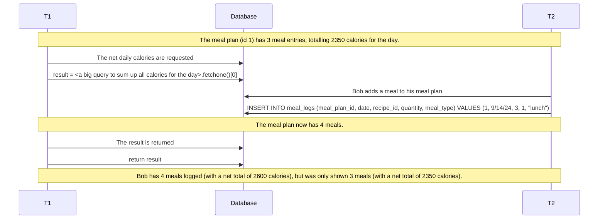
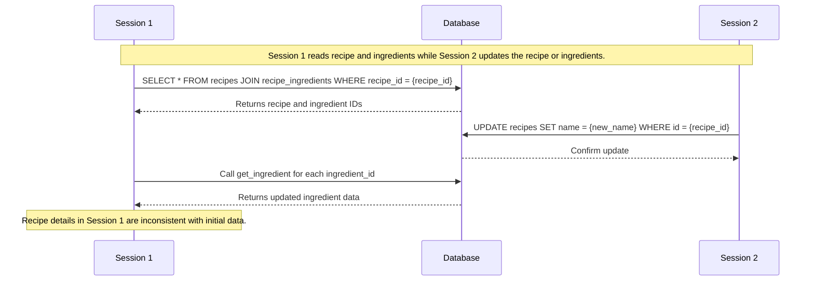
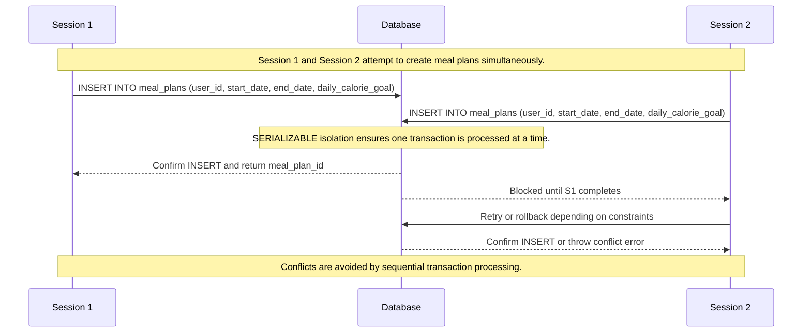

The get_daily_calories endpoint addresses concurrency issues such as phantom reads and non-repeatable reads. When calculating the total calories consumed on a specific day, concurrent transactions may add or modify meal entries, potentially leading to inaccurate results. Phantom reads occur when new records are added during the calculation, altering the totals unexpectedly. Similarly, non-repeatable reads happen if calorie counts are updated during the process.

The get_recipe endpoint demonstrates the challenges of non-repeatable reads. This issue arises when retrieving a recipe and its associated ingredients while another transaction updates the same data. For example, a recipe’s details or ingredients might change between reads, resulting in inconsistencies in the retrieved information.

The create_meal_plan endpoint focuses on preventing conflicts using the SERIALIZABLE isolation level. When multiple users attempt to create meal plans simultaneously, overlapping or conflicting entries can occur without proper safeguards. By applying the SERIALIZABLE isolation level, transactions are processed as though they occur sequentially, eliminating risks of conflicts.

#1

#2

#3

